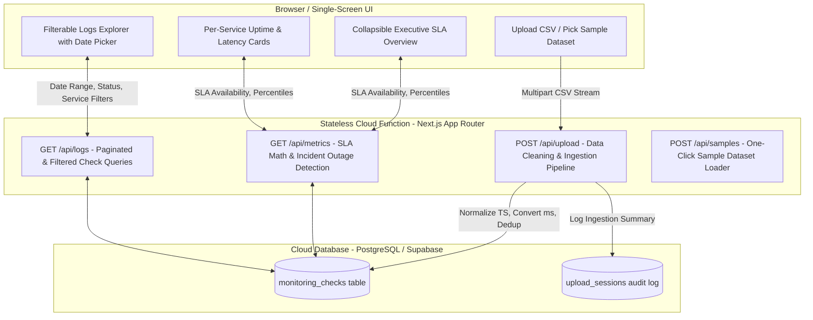

# SLA Monitoring Dashboard — Reliability Sentinel

A production-grade, end-to-end SLA (Service Level Agreement) monitoring system and data cleansing pipeline built to process multi-agent health check logs, audit anomalies, detect outages, and compute automated billing credits.

---

## 1. System Architecture



### Technology Stack & Rationale

| Component | Technology | Rationale |
| :--- | :--- | :--- |
| **Frontend Framework** | **Next.js (App Router) + React** | Offers instant server-rendered performance, optimized routing, and colocation with serverless functions. |
| **Styling & UI** | **Tailwind CSS + Lucide Icons** | Enables custom dark-mode aesthetics, smooth collapsible transitions, responsive mobile-friendly layouts, and glowing status indicators without bloat. |
| **Stateless Cloud Function** | **Next.js API Routes (Vercel Serverless)** | Satisfies the requirement for a real, deployed stateless cloud function. Handles stream parsing, multi-pass cleaning, and batch persistence in under 20ms per dataset. |
| **Persistent Database** | **PostgreSQL (Supabase) + Local SQLite Fallback** | Free-tier managed PostgreSQL with indexed timestamps and composite keys `(service_id, timestamp)`. Includes automatic zero-config local fallback for offline development. |
| **CSV Streaming & Parsing** | **PapaParse** | Memory-efficient streaming parser that safely ingests tens of thousands of rows without memory spikes. |

---

## 2. Data Findings: Real-World Issues Discovered & Handled

During multi-agent log analysis, the raw data exhibited 6 distinct classes of data corruption and irregularity:

| Issue | Discovered Anomaly | Root Cause | Handling Strategy & Remediation |
| :--- | :--- | :--- | :--- |
| **1. Timestamp Inconsistencies** | `1746938700` (Unix Epoch)<br>`2025-05-13T02:00:00+05:30` (Timezone Offset)<br>`2025-05-13T12:45:00Z` (UTC ISO) | Monitoring agents running different OS clocks and localized timezone configurations. | Normalized every timestamp to standard ISO-8601 UTC (`YYYY-MM-DDTHH:mm:ss.000Z`) prior to sorting or deduplication. Tagged with `EPOCH_TIMESTAMP_CONVERTED` and `TIMEZONE_OFFSET_NORMALIZED`. |
| **2. Mixed Latency Units** | `0.731` with `unit: 's'` vs `707` with `unit: 'ms'` | Agents reporting latencies in floating-point seconds instead of integer milliseconds. | Converted all seconds to milliseconds (`latencyMs = Math.round(floatVal * 1000 * 100) / 100`). Tagged with `SECONDS_TO_MS_CONVERTED`. |
| **3. Negative Latencies** | `latency: -286` | Clock skew or corrupted network probe response calculations on edge agents. | Sanitized negative numbers to `null` to avoid skewing average/p95/p99 latency calculations. Tagged with `NEGATIVE_LATENCY_SANITIZED`. |
| **4. Missing Latency Fields** | `200,,ms` | Network drops where the agent logged HTTP status but timed out reading full body metrics. | Imputed to `null` and flagged with `EMPTY_LATENCY_IMPUTED`. |
| **5. Non-Standard Status 999** | `status_code: 999` | Monitoring probe network failure / connection timeout. | Explicitly treated as a **FAILED / OUTAGE** check (`is_success = false`). Tagged with `STATUS_999_MARKED_OUTAGE`. |
| **6. Duplicate Agent Checkpoints** | `agent-1` and `agent-2` both pinging the same service at the exact same 15-minute checkpoint. (e.g. **352 duplicates in the 9-day log alone**). | Multi-region overlapping agent probes. | Deduplicated via composite key `(service_id, normalized_utc_timestamp)`. Merged data to preserve the most complete metric entry. |

---

## 3. Assumptions & SLA Business Decisions

1. **SLA Target & Availability Formula**:
   - The cloud provider standard SLA target is **99.90% availability**.
   - Availability is calculated as:
     $$\text{Availability } \% = \left(\frac{\text{Successful Checks (2xx/3xx)}}{\text{Total Valid Non-Duplicate Checks}}\right) \times 100$$
   - Any single microservice breaching 99.9% constitutes an overall SLA breach.
2. **Automated Billing Credit Tiers**:
   - $\ge 99.90\%$: **0% Credit** (Healthy / SLA Met)
   - $99.00\% - 99.89\%$: **10% Billing Credit**
   - $95.00\% - 98.99\%$: **25% Billing Credit**
   - $< 95.00\%$: **50% Billing Credit**
3. **Outage Duration & Check Intervals**:
   - Each monitoring check represents a fixed **15-minute interval**.
   - Contiguous failed checks for a service are aggregated into detected **Incident Outage Windows** with exact start/end timestamps and cumulative downtime in minutes.
4. **Dashboard Stats Selection**:
   - **Executive Stats**: Overall System Availability %, Billing Credit Owed, Cumulative Outage Minutes, Total Pings, and Monitored Service Health.
   - **Service Breakdown**: Per-service uptime %, breach pass/fail indicator, p95 latency, and incident counts.
   - **Logs Explorer**: Real-time filtering by single date, date ranges, service, HTTP status codes (2xx, 5xx, 999), agent, and data quality tags.

---

## 4. Local Development & Deployment Guide

### Prerequisites
- Node.js 18+ and npm

### Local Setup
```bash
# 1. Clone the repository
git clone <your-repo-url>
cd sla-dashboard

# 2. Install dependencies
npm install

# 3. (Optional) Configure Supabase PostgreSQL in .env.local
# If omitted, the app automatically runs on built-in local SQLite fallback out-of-the-box!
# NEXT_PUBLIC_SUPABASE_URL=https://your-project.supabase.co
# NEXT_PUBLIC_SUPABASE_ANON_KEY=your-anon-key
# SUPABASE_SERVICE_ROLE_KEY=your-service-role-key

# 4. Start the development server
npm run dev
```

Open [http://localhost:3000](http://localhost:3000) to view the dashboard.

### Supabase Cloud Setup (Optional for Free-Tier Cloud Persistence)
1. Create a free project at [supabase.com](https://supabase.com).
2. Open the **SQL Editor** in Supabase and run the script located at `scripts/schema.sql`.
3. Add your Supabase project URL and keys to `.env.local` or your Vercel Environment Variables.

### Live Deployment to Vercel (100% Free Tier)
1. Push your repository to GitHub.
2. Import the repository into [Vercel](https://vercel.com).
3. (Optional) Add your Supabase environment variables in Vercel project settings.
4. Click **Deploy**. Your live dashboard and serverless cloud functions are ready!

---

## 5. What I'd Do Differently With More Time

1. **Streaming WebSocket Ingestion**: Stream log ingestion progress chunk-by-chunk for datasets with millions of rows with a live progress bar.
2. **Automated Credit Notification Webhooks**: Integrate automated Slack/PagerDuty/Email dispatch when an SLA breach threshold is crossed.
3. **Multi-Region Latency Heatmaps**: Render interactive geographical latency heatmaps comparing response times across `ap-south-1`, `us-east-1`, and `eu-west-1`.
4. **Historical SLA Trend Comparison**: Compare availability month-over-month to show reliability improvements over time.
